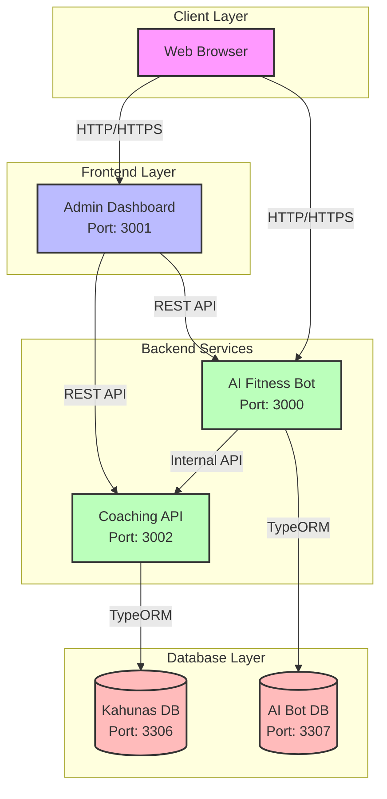

# System Architecture

## Service Interaction Diagram

## Component Details

### Client Layer
- **Web Browser**: Entry point for users accessing the admin dashboard and AI chatbot

### Frontend Layer
- **Admin Dashboard (Port 3001)**
  - Next.js application
  - Manages clients and analytics
  - Communicates with both the Coaching API and AI Bot

### Backend Services
- **AI Fitness Bot (Port 3000)**
  - NestJS service
  - Provides AI-powered fitness advice
  - Maintains its own database for conversation history
  - Communicates with Coaching API for user validation

- **Coaching API (Port 3002)**
  - NestJS service
  - Core business logic
  - User management
  - Session tracking
  - Analytics

### Database Layer
- **Kahunas DB (Port 3306)**
  - MySQL 8.0
  - Stores user data
  - Coaching sessions
  - System configuration

- **AI Bot DB (Port 3307)**
  - MySQL 8.0
  - Stores chat history
  - Response metrics
  - Usage analytics

## Network Configuration

All services communicate through a Docker bridge network named `app-network`. The communication flow is secured using:
- JWT authentication for API requests
- Internal network isolation using Docker
- Rate limiting on public endpoints

## Data Flow

1. **User Authentication**
   - Users authenticate through the Admin Dashboard
   - JWT tokens are used for subsequent requests

2. **Admin Dashboard Operations**
   - Dashboard queries Coaching API for user management
   - Fetches analytics data from both services
   - Displays AI bot statistics and performance metrics

3. **AI Bot Operations**
   - Validates users through Coaching API
   - Stores conversation history in dedicated database
   - Reports usage metrics back to admin dashboard

4. **Database Operations**
   - Each service maintains its own database connection
   - No cross-database queries
   - Data synchronization handled at service level 